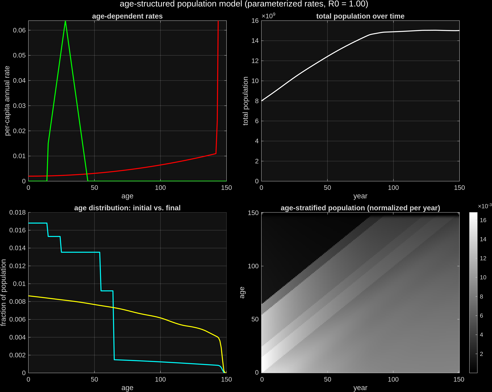

# steadyStatePopulation

A minimal age-structured (Leslie-matrix / cohort-component) population model in MATLAB.
Age-dependent birth (fertility) and death (mortality) rates drive a population of yearly age
cohorts forward in time. By default, fertility is auto-calibrated to a target net reproduction
rate, which is what makes the population settle into a genuine **steady state** rather than growing
or shrinking without bound — see [`populationModel.md`](populationModel.md) for why. The rates
themselves are swappable too: hand-tuned parameterized curves (default) or current real-world
age-specific rates — see [Rate source](#rate-source).

- **top-left** — the age-dependent rates driving the model: mortality (red, rising with age, with
  an optional sharp senescence cliff late in life) and fertility (green, a triangular pulse over
  the fertile age window).
- **top-right** — total population over time, settling from its (deliberately non-stable) initial
  condition toward a steady long-run value.
- **bottom-left** — the initial (current real-world) vs. final (model's own stable) age
  distribution, directly comparing the starting and converged shapes.
- **bottom-right** — the full age-stratified population, normalized within each year, showing the
  age distribution's shape converge over time.

## Running it

Everything lives in a single script, [`doIt.m`](doIt.m). Open it in MATLAB and run it — no data,
no dependencies. All model parameters (age range, mortality/fertility shape, senescence cliff,
simulation horizon, target net reproduction rate) sit together in one `CONTROL PANEL` block near
the top; edit and re-run. The script ends by exporting the figure above to
`figures/populationModel.png`.

## Rate source

`rateSource` (a `CONTROL PANEL` parameter, default `'parameterized'`) picks between two
independent implementations of the mortality/fertility curves, selected by a `switch` in
`doIt.m` — everything downstream (survival, R0, the cohort simulation) uses whichever
`mortality(age)`/`fertility(age)` that switch produces, unchanged:

- **`'parameterized'`** (default) — the hand-tuned Gompertz-plus-senescence-cliff mortality and
  triangular fertility described above and in [`populationModel.md`](populationModel.md), with
  fertility rescaled to hit `targetR0` exactly.
- **`'empirical'`** — the current real-world age-specific rates for the World: fertility from the
  2023 age-specific fertility rate by 5-year age band, and mortality from the 2021 life table's
  probability of dying within each age band (both from
  [Our World in Data](https://ourworldindata.org/), sourced from UN World Population Prospects).
  Converted to this model's per-capita annual-rate convention (life-table band probability →
  annual hazard; per-1000-women fertility → per-capita, assuming a 50/50 sex split). Mortality
  beyond the data's oldest covered age (84) is extrapolated with a Gompertz (log-linear) fit to
  the last 5 empirical bands, rather than left undefined out to `ageMax`. Unlike the parameterized
  mode, fertility here is used *as-is* — not rescaled to `targetR0` — so whatever net reproduction
  rate the real data implies is what the model runs with (currently R0 ≈ 1.06, i.e. mild long-run
  growth, consistent with the world's fertility currently sitting slightly above replacement).

## Net reproduction rate (R0)

R0 is the expected number of offspring a person has over their entire lifetime, given the model's
mortality schedule — the standard demographic summary of whether a population is (more than)
replacing itself: `R0 = sum(survivorship .* fertilityShape)`, where `survivorship` is the
probability of surviving from birth to each age (itself derived from the mortality curve) and
`fertilityShape` is the *unscaled* fertility-by-age curve, before any calibration — NOT what's
plotted in the top-left panel, which shows the already-final `fertility`.

What happens next depends on [rate source](#rate-source). In `'parameterized'` mode, fertility is
rescaled so this R0 hits `targetR0` (a `CONTROL PANEL` parameter, default `1`):
`fertility = fertilityShape * (targetR0 / R0)`. This calibration is what that mode hinges on —
`targetR0 = 1` isn't just a plausible-looking number, it's the exact condition for a long-run
steady population (`>1` grows, `<1` declines); see
[`populationModel.md`](populationModel.md#8-why-r_01-gives-a-steady-state--the-eulerlotka-connection)
for the Euler–Lotka argument why. In `'empirical'` mode, `fertility = fertilityShape` is used
as-is — R0 is simply computed and reported (in the figure title), not targeted.

## Formalism

[`populationModel.md`](populationModel.md) derives the model's equations in the order `doIt.m`
computes them — mortality, survival, fertility calibration, the cohort-update recursion — plus the
Euler–Lotka argument for why calibrating fertility to a net reproduction rate of 1 gives an exact
steady state, not an approximation.
